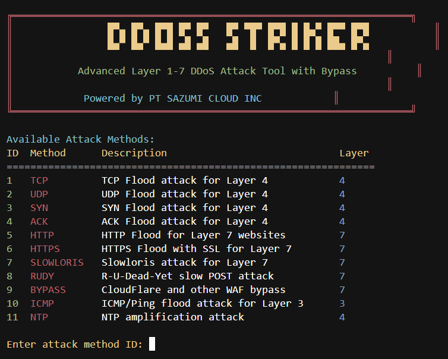

# DDoS Striker



DDoS tool supporting Layer 1-7 attacks with WAF bypass capabilities.

**WARNING: This tool is for EDUCATIONAL PURPOSES ONLY. Only use against illegal websites like phishing sites, illegal gambling sites, or scam websites with proper authorization. Unauthorized usage against legitimate websites is illegal and could result in criminal prosecution.**

## Features

- Support for multiple attack methods (Layers 1-7)
- WAF/CloudFlare bypass techniques
- Terminal-based menu interface
- Multi-threaded for maximum efficiency
- Detailed attack statistics
- Command line argument support

## Supported Attack Methods

### Layer 3/4 Attacks
- TCP Flood
- UDP Flood
- SYN Flood
- ACK Flood
- NTP Amplification

### Layer 7 Attacks
- HTTP Flood
- HTTPS Flood
- Slowloris
- RUDY (R-U-Dead-Yet)
- CloudFlare/WAF Bypass

### Layer 3 Attacks
- ICMP Flood (Ping Flood)

## Installation

```bash
# Clone the repository
git clone https://github.com/sazumivicky/ddos_striker.git
cd ddos-striker

# Install dependencies
pip install -r requirements.txt
```

## Usage

### Interactive Mode

```bash
python ddos_striker.py
```

### Command Line Mode

```bash
python ddos_striker.py -m [METHOD_ID] -t [TARGET] -p [PORT] -d [DURATION] -th [THREADS]
```

#### Parameters:
- `-m, --method`: Attack method ID (1-11)
- `-t, --target`: Target IP or URL
- `-p, --port`: Target port (default: 80)
- `-d, --duration`: Attack duration in seconds
- `-th, --threads`: Number of threads (default: 100)

## Example

```bash
python ddos_striker.py -m 5 -t btch.com -p 80 -d 60 -th 150
```

This will start an HTTP flood attack against btch.com on port 80 for 60 seconds using 150 threads.

## Legal Disclaimer

This tool should only be used for legitimate security testing with proper authorization or against illegal websites like phishing sites. The authors are not responsible for any misuse of this tool. Always ensure you have legal authorization before conducting any security testing. 